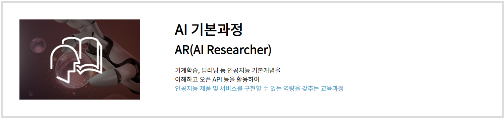
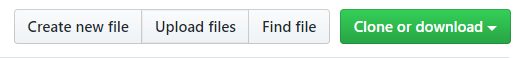

# [AI 이노베이션 스퀘어 기본과정 저녁반](https://realblack0.github.io/ai_lecture_fundamental/)

<div align="center">
  <h2 style='font-weight: bold; font-size:18px;'>주관</h2>
  <a href='https://www.msit.go.kr/web/main/main.do'>
    
  </a>
  &nbsp;&nbsp;&nbsp;
  <a href='https://ai.koipa.or.kr/'>
    
  </a>
</div>
<br/>


## 다운로드
아래의 이미지처럼 `Clone or download` -> `Download ZIP` 버튼을 누르셔서 자료를 받으실 수 있습니다.<br/>
<div align="center">
  <br/>
</div>

혹은 다음과 같이 `git clone` 커맨드로 받으실 수 있습니다.
```dos
git clone https://github.com/realblack0/ai_lecture_fundamental.git
```


## 문의사항
- issues page: https://github.com/realblack0/ai_lecture_fundamental/issues
- e-mail: realblack0@gmail.com
- AI 이노베이션 스퀘어: https://ai.koipa.or.kr/
- LMS 홈페이지: https://lms.koipa.or.kr/
